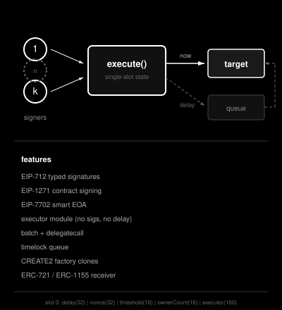
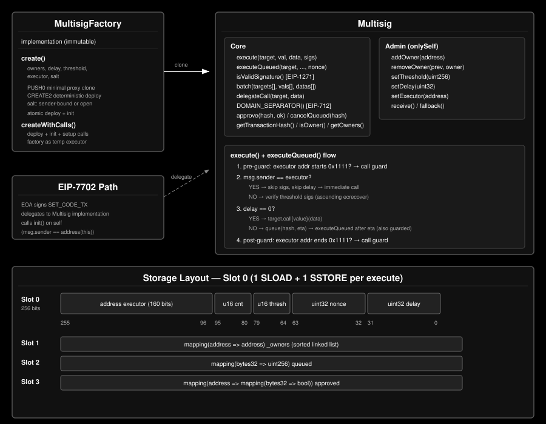

# Multisig

<picture>
  <source media="(prefers-color-scheme: dark)" srcset="dark-logo.svg">
  <source media="(prefers-color-scheme: light)" srcset="logo.svg">
  
</picture>

A minimal k-of-n multisig wallet with an embedded timelock, an executor role that
doubles as a pre/post transaction guard, on-chain approvals, batched execution and
delegatecall — in one 321-line file, with all mutable state packed into a single
storage slot. Two ways to get one: a CREATE2 factory clone, or an EIP-7702
delegation that turns an existing EOA into the same account without moving anything.





## This book

| Section | What it covers |
|---|---|
| [Protocol](protocol/overview.md) | The contracts: storage layout, both deployment paths, signature verification, the timelock, the executor role, the modules |
| [Interface](dapp/overview.md) | The dapp in `dapp/`: what it does, what it refuses to do, and how it is put together |
| [Contract Reference](reference.md) | Generated per-contract APIs, straight from the source |

Start with [Protocol Overview](protocol/overview.md) for how the wallet works, or
[The Interface](dapp/overview.md) if you are here to operate one.

Anyone about to deploy a wallet should read two chapters in particular:
[Security](protocol/security.md), for what five independent reviews found and what
remains open, and [Guardrails](dapp/guardrails.md), for the configurations that are
one-way doors.

## Quickstart

```bash
forge build
forge test
```

`dapp/index.html` has no build step — open it.

## Live addresses

| Contract | Address |
|---|---|
| `MultisigFactory` | [`0x000000000e8CB9ed9DC2114d79d9215eacb9cB07`](https://contractscan.xyz/contract/0x000000000e8CB9ed9DC2114d79d9215eacb9cB07) |
| `Multisig` (implementation) | [`0xD54cb65224410F3Ff97a8E72f363f224419f4FB0`](https://contractscan.xyz/contract/0xD54cb65224410F3Ff97a8E72f363f224419f4FB0) |
| `TimelockExecutor` | [`0x00000000a72A30AdBf38e14d36BCE2610ec3973F`](https://contractscan.xyz/contract/0x00000000a72A30AdBf38e14d36BCE2610ec3973F) |

Chain coverage and the clone bytecode to verify against are in
[Deployment](protocol/deployment.md#live-addresses).

## Elsewhere in the repository

- [`README.md`](https://github.com/src-company/multisig/blob/main/README.md) — the
  short version of everything here
- [`SECURITY.md`](https://github.com/src-company/multisig/blob/main/SECURITY.md) —
  the authoritative security posture document and reviewer guide
- [`audit/`](https://github.com/src-company/multisig/tree/main/audit) — every review
  reproduced in full, with a response against each finding

## License

MIT
