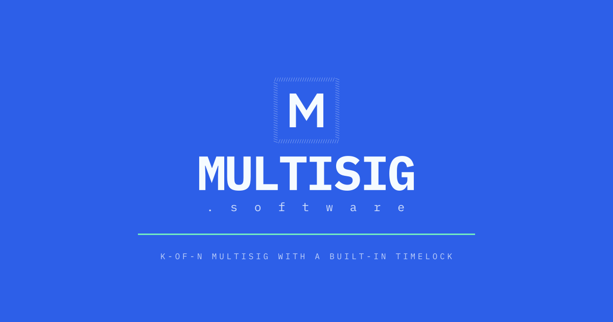

# Brand & Press

Everything you need to write about Multisig, or to feature it in your own
product, without having to ask us first.

<picture>
  <source media="(prefers-color-scheme: dark)" srcset="brand/multisig-lockup-blue.svg">
  
</picture>

The logo files, the palette and the placement rules are in
[`brand/`](https://github.com/src-company/multisig/tree/main/brand). This page
is the words: descriptions at four lengths, a plain-English explanation, the
numbers and where they come from, and what we are careful *not* to claim.

All of it is MIT-licensed. Quote it, edit it, paste it into your CMS. No
permission needed, no embargo, no approval step. If you need something that
isn't here, or want a claim checked before it runs:
**[ross@wei.domains](mailto:ross@wei.domains)**.

---

## Boilerplate

Take whichever fits the hole. These are written to be used verbatim.

**One line (16 words)**

> Multisig is a k-of-n multisig wallet with a built-in timelock, in a single
> file of Solidity.

**Standfirst (29 words)**

> Multisig is an open-source wallet that requires several people to approve
> before money moves, with a delay built in so a bad transaction can be
> cancelled before it lands.

**Short (56 words)**

> Multisig is an open-source smart contract wallet where a set number of owners
> must approve before funds move. Unlike most multisigs, the timelock is built
> into the wallet itself rather than bolted on, so a queued transaction is
> visible — and cancellable — before it executes. It is free, unowned, immutable
> and live on five chains.

**Long (109 words)**

> Multisig is an open-source smart contract wallet for groups who hold money
> together: treasuries, protocol admins, funds, families. A transaction only
> executes once k of n owners have approved it, and an optional delay holds
> approved transactions in a public queue where anyone can see them coming and
> the owners can still cancel. Both the threshold and the timelock live in the
> wallet contract itself — 275 lines in one file, with every piece of mutable
> state packed into a single storage slot, which makes it roughly half the
> bytecode and a third to a half cheaper to deploy than the incumbent. It is
> MIT-licensed, immutable, and charges nothing.

---

## What it actually is

*For a reader who has never touched a wallet.*

A **multisig** is a shared account that no single person can empty. Instead of
one key, there are several, and the account only moves money when enough of
them agree. "3-of-5" means five people hold keys and any three can authorise a
payment. Lose a key, and the other four still work. Steal a key, and one is not
enough.

DAOs, protocol treasuries, exchanges and crypto funds nearly all run on one.
When you read that a project's treasury is "controlled by a 4-of-7", this is
the thing being described.

**Multisig** — the project this page is about — is one of those, written from
scratch to be as small as it can be, with two things built in that are usually
add-ons:

**A timelock.** Turn it on and approved transactions don't execute; they sit in
a public queue with a timestamp. Anyone can see exactly what is about to happen
and how long they have. If the owners are being coerced, or a key was stolen,
or someone simply made a mistake, there is a window to cancel. Protocols use
this so their users can exit before an admin change takes effect.

**An executor.** One optional address that can act without signatures and
without waiting — the break-glass. Two things people use it for: a *security
council* that can move instantly during a live exploit while the ordinary
owners stay behind the delay, and *social recovery*, where trusted friends can
rotate the keys of someone who has lost theirs. The owners choose whether to
appoint one, and can remove it.

### A transaction, end to end

1. **Propose.** An owner builds a transaction — send 10 ETH here, call this
   contract. The interface shows the decoded effect before anyone signs.
2. **Approve.** Other owners sign it, off-chain and free, or approve it
   on-chain. Nothing has happened yet.
3. **Execute.** Once the threshold is met, anyone can submit it. Without a
   delay it runs immediately. With a delay it joins the queue, and runs when
   the clock expires — unless it is cancelled first.

---

## What makes it different

| | |
|---|---|
| **The timelock is part of the wallet** | Most multisigs need a second contract wired in front to get a delay. Here `delay` is a field on the wallet. Fewer moving parts, one thing to audit. |
| **One file** | The wallet and its factory are 275 lines of Solidity in a single file. You can read the whole thing in an afternoon, which is the only real way to trust it. |
| **One storage slot** | Delay, nonce, threshold, owner count and executor are packed together. That is where most of the gas saving comes from. |
| **Same address on every chain** | Deployed with CREATE2, so a wallet has one address across Ethereum, Base, MegaETH, Arbitrum and OP Mainnet. |
| **Works on a normal wallet too** | Under EIP-7702, an existing EOA can take on multisig behaviour without moving funds to a new address, while its owner keeps the original key. |
| **Nobody can change it** | The contracts are immutable. There is no admin key, no upgrade path, and no proxy we control. |
| **It costs nothing** | No token, no fee, no revenue. A public good by [src_co](https://github.com/src-company). |

---

## The numbers

Every figure below is reproducible from the repository. The comparison is
against Safe v1.4.1, the de facto standard, running as its exact canonical
mainnet bytecode inside the same test harness — so there is no compiler or
optimiser difference doing the work.

| | Multisig | Safe v1.4.1 | |
|---|---|---|---|
| Wallet bytecode | 10,532 B | 23,579 B | **55% less** |
| At feature parity¹ | 12,881 B | 32,680 B | **61% less** |
| Source, lines of code | 275 | 702 | **61% fewer** |
| Deploy a 3-owner wallet | 183,171 gas | 306,366 gas | **40% cheaper** |
| Send ETH, 2-of-3 | 52,918 gas | 61,113 gas | **13% cheaper** |
| Storage slots for core state | 1 | several | |
| Timelock | built in | needs a second contract | |

¹ Adds Safe's `CompatibilityFallbackHandler` and `MultiSendCallOnly`, since
this wallet has both built in.

Deployment savings run from **35% to 47%** depending on owner count; steady-state
execution from **12% to 16%**. Batching is a wash, and the executor path costs
about 6% more — [the comparison
chapter](protocol/comparison.md) says why, and does not round it in our favour.

```bash
forge test --mc SafeComparisonTest -vv    # every gas figure above
forge build --sizes                       # every bytecode figure above
```

Other verifiable facts: **100% test coverage**, a **45-byte** proxy per wallet,
and an **MIT** licence.

### On the reviews

Five reviews are published, and they are not all the same kind of thing. Please
don't flatten them into "audited":

| | |
|---|---|
| **Shred Security** (2026-07-11) | External, human — kenzo and yashar — with stateful invariant fuzzing. 0 high, 0 medium. |
| **GPT-5.6 Sol**, **Claude Opus 5**, **leftclaw** (2026-07) | External, model- and agent-driven. |
| **Pashov Skills** (2026-04) | An *internal* 8-agent pass, run before the external ones. Widest scope, and the reason `cancelQueued` exists at all. |

Severities were not consistent between them — one critical rested on a
misreading, and two mis-sized the same arithmetic bug by a factor of 65. Every
finding, including the disputed ones and the arguments against them, is in
[Security](protocol/security.md) and
[`SECURITY.md`](https://github.com/src-company/multisig/blob/main/SECURITY.md).

The one line worth quoting, and the one we stand behind:

> No reviewer found a way for an unauthorised party to move funds from a
> correctly configured wallet.

The qualifier is load-bearing. Several findings are real and
configuration-dependent — a wallet set as its own executor bricks itself, and
funds sent directly to the factory are gone permanently. Both are documented
warnings, not surprises.

---

## What it is not

Worth stating plainly, because these are the assumptions a crypto story usually
carries in by default.

- **Not custodial.** We cannot move your funds. There is no key, no admin
  function and no upgrade hatch that would let us.
- **Not a token.** There is no coin, no airdrop, no points programme and no
  fundraise. Nothing to buy.
- **No fees.** Not on deployment, not on execution, not ever. The only cost is
  the chain's own gas.
- **Not upgradeable.** The deployed contracts are immutable. That is a
  deliberate trade: no upgrade key to steal, but also no patching. It is why
  the audits matter.
- **Not a Safe fork.** It is a separate implementation with its own interface.
  Safe is the comparison because it is the standard, not the source.
- **Not a company product.** No support contract, no SLA, no roadmap
  commitment. It is a public good, maintained in the open.
- **Not risk-free.** It is new, and the reviews found real issues — read
  [Security](protocol/security.md) before you write that it is "audited" full
  stop. The findings and their dispositions are all public.

---

## Naming

The product name collides with the generic noun, so the first mention should
disambiguate — after that, either form is clear from context.

| | |
|---|---|
| **The product** | *Multisig*, capital M, one word. On first mention: "Multisig (multisig.software)". |
| **The concept** | lowercase — "a multisig", "multisig wallets". |
| **The site** | multisig.software, lowercase. |
| **The maker** | src_co, lowercase with the underscore. GitHub: `src-company`. |
| **Never** | MultiSig, Multi-Sig, MULTISIG in running text, Multisig.software mid-sentence, "the Multisig protocol". |

It is a **wallet**, not a protocol and not a platform. It is **open source**,
not "decentralised". Owners **approve** or **sign**; they do not "vote".
Transactions are **queued** and **executed**, not "processed".

---

## Logos and images

Files, finishes, clear space, palette and the do-not list are in
[`brand/README.md`](https://github.com/src-company/multisig/tree/main/brand).
The short version:


- **The lockup** for articles, slides and partner pages.
- **The mark alone** for favicons, chain pickers and table rows — it holds at
  24px.
- Four finishes: blue (primary, carries its own field), light, and transparent
  white and black.
- SVG is the master. PNGs at 32–2048px are in
  [`brand/logo/png/`](https://github.com/src-company/multisig/tree/main/brand/logo/png).
- Clear space is a quarter of the mark's height, and it is already baked into
  the lockup files.
- Colours: Signal Blue `#2D5FE8`, Ice `#F5FBFF`, Mint `#7DFFBA`. Type is IBM
  Plex Mono throughout.
- Please don't recolour, stretch or re-set the wordmark. There is a finish for
  every background.

**Share card**, 1200×630 —
[`brand/social/`](https://github.com/src-company/multisig/tree/main/brand/social):



There is also an animated launch card,
[`launch/multisig-launch.gif`](https://github.com/src-company/multisig/blob/main/launch/multisig-launch.gif),
if you need motion.

---

## For product teams

If you are listing Multisig as an option in a wallet, an explorer or an
integration directory:

- Link to **multisig.software** for the app, or the
  [repository](https://github.com/src-company/multisig) for the contracts.
- Label it "Multisig" — not "Multisig Wallet", which reads as generic.
- Verify what you are pointing at. Every wallet is the same 45-byte clone, so
  its runtime code can be checked byte-for-byte against the audited build; the
  factory and implementation addresses are in the fact sheet below and on
  [contractscan.xyz](https://contractscan.xyz).
- The one-line description for a directory entry: *k-of-n multisig wallet with
  a built-in timelock.*

---

## Fact sheet

| | |
|---|---|
| **Name** | Multisig |
| **What** | Open-source k-of-n smart contract wallet with a built-in timelock |
| **Site** | multisig.software |
| **Repository** | [github.com/src-company/multisig](https://github.com/src-company/multisig) |
| **Licence** | MIT |
| **Maker** | src_co |
| **First commit** | 2026-03-31 |
| **Mainnets** | Ethereum, Base, MegaETH, Arbitrum, OP Mainnet |
| **Testnets** | Sepolia, Base Sepolia |
| **Source size** | 275 lines, one file (wallet + factory) |
| **Test coverage** | 100% |
| **Security reviews** | 5, all published — one external human audit, three external agent reviews, one internal ([details](protocol/security.md)) |
| **Token** | None |
| **Fees** | None |
| **Upgradeable** | No — immutable |

**Contracts**, identical addresses on every chain above:

| | |
|---|---|
| MultisigFactory | [`0x000000000e8CB9ed9DC2114d79d9215eacb9cB07`](https://contractscan.xyz/contract/0x000000000e8CB9ed9DC2114d79d9215eacb9cB07) |
| Multisig (implementation) | [`0xD54cb65224410F3Ff97a8E72f363f224419f4FB0`](https://contractscan.xyz/contract/0xD54cb65224410F3Ff97a8E72f363f224419f4FB0) |
| TimelockExecutor | [`0x00000000a72A30AdBf38e14d36BCE2610ec3973F`](https://contractscan.xyz/contract/0x00000000a72A30AdBf38e14d36BCE2610ec3973F) |

---

## Contact

**Press: [ross@wei.domains](mailto:ross@wei.domains)** — for comment, review
copy, a higher-resolution asset, or a fact you want checked before it runs. Say
in the subject line if you are on a deadline. There is no embargo process to
negotiate and no approval step.

Everything else — bugs, integration questions, feature arguments — belongs on
[github.com/src-company/multisig](https://github.com/src-company/multisig), in
the open. Security reports go through
[`SECURITY.md`](https://github.com/src-company/multisig/blob/main/SECURITY.md);
please don't put a vulnerability in an email or an issue.
